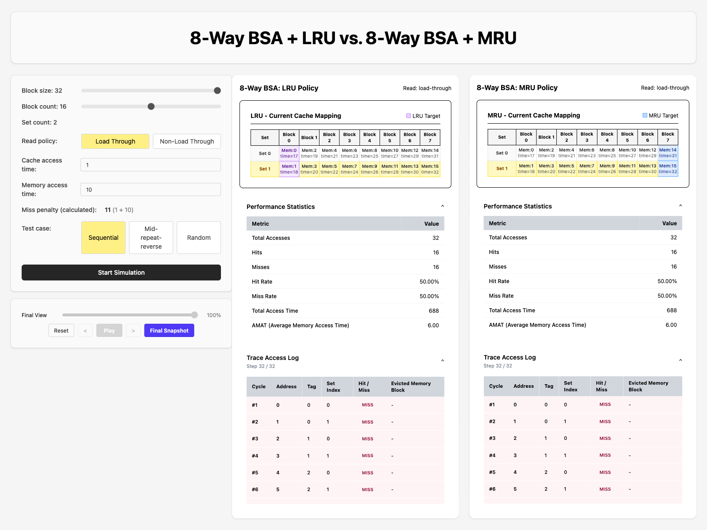
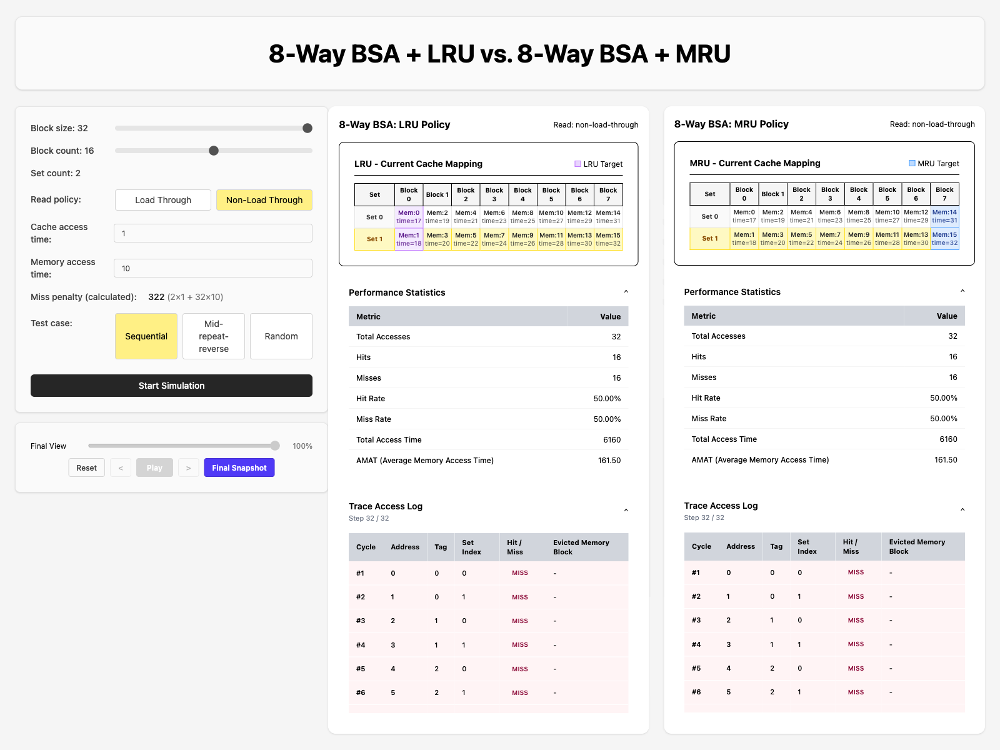
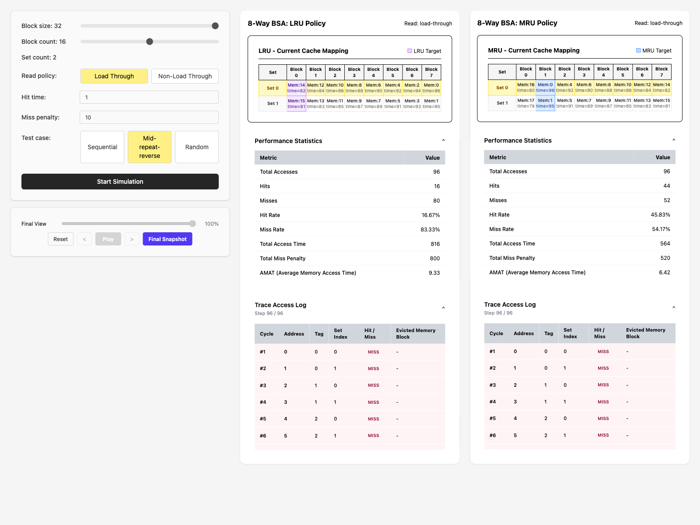
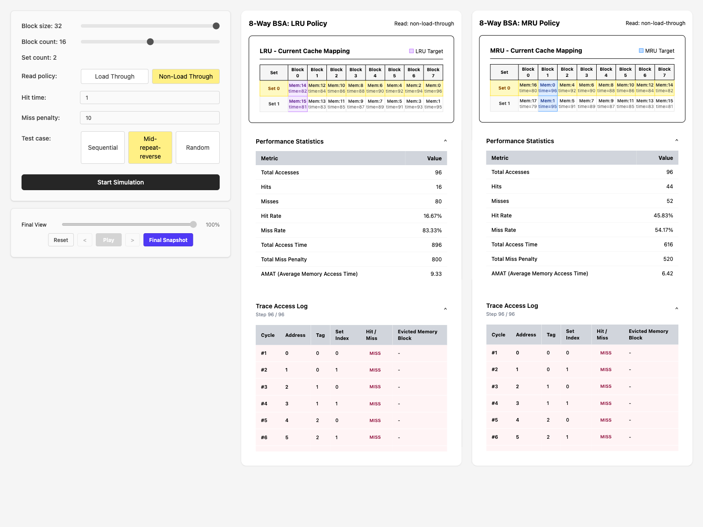
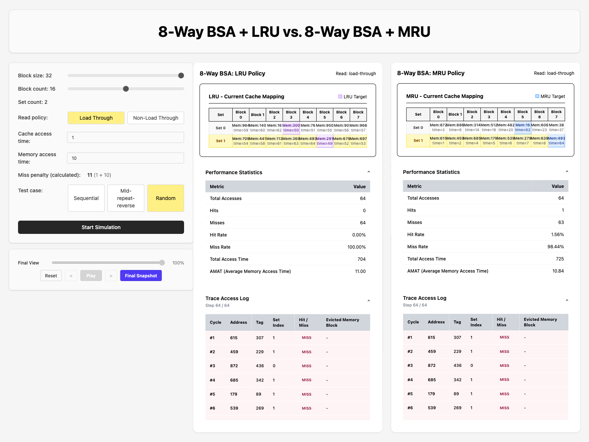
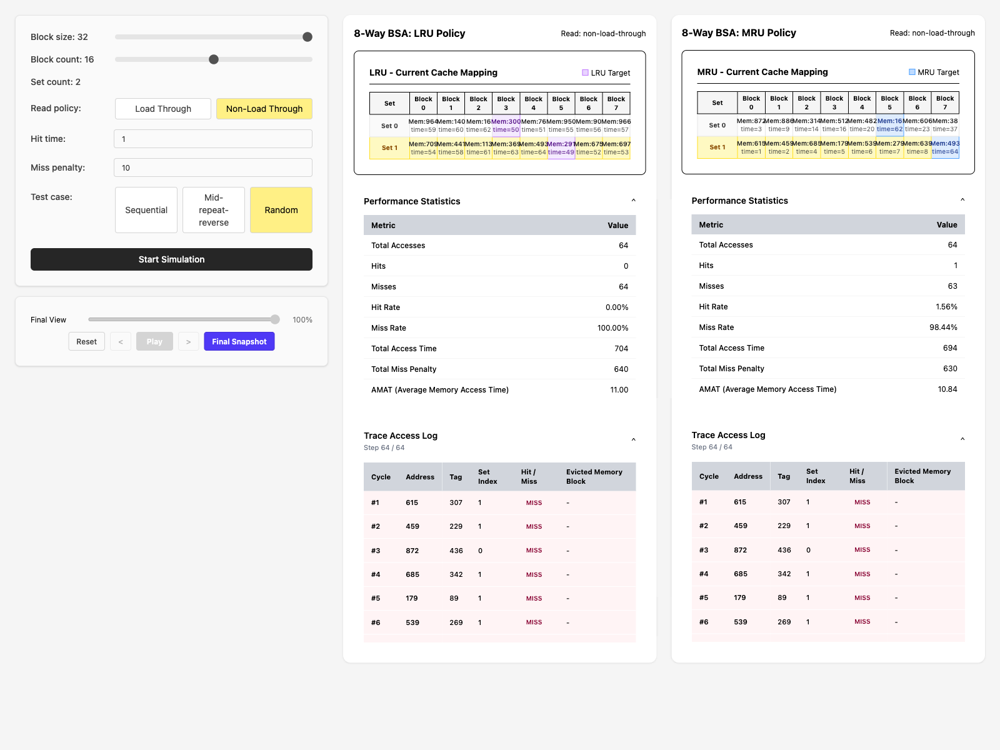

# CSARCH2 Case Study 1 — Cache Memory Simulator

## Deployment Link

https://csarch-2-case-study-1.vercel.app/?fbclid=IwY2xjawTeZG5leHRuA2FlbQIxMQBzcnRjBmFwcF9pZAEwAAEeMch8huglsmq-qnWOJkzOljirOqx9eykaLtS9M-TEO2tgVMoBodWSR4atY3o_aem_WRGwC27zxs9LRsUSUmMPng

## Youtube Demo

https://youtu.be/mBf50dkN5P0?si=g2D8cifVrHT1KQZD

## Specifications

**Machine 9 — 8-Way Block Set-Associative (BSA) Cache with LRU vs MRU**

This simulator implements two 8-way set-associative caches that differ only in their replacement policy, running identical address traces so the user can compare LRU and MRU behaviour side by side.

### Common Parameters (all test cases)

| Parameter              | Values / Constraints                 |
| ---------------------- | ------------------------------------ |
| Block size             | Power of 2, ≥ 2 words                |
| Number of cache blocks | Power of 2, ≥ 4                      |
| Associativity          | 8 ways (fixed for Machine 9)         |
| Number of sets         | blockCount / 8                       |
| Main memory            | 1024 blocks fixed                    |
| Read policy            | Load-through **or** Non-load-through |
| Replacement policy     | LRU **or** MRU (run simultaneously)  |
| Hit time (cycles)      | Parameterised                        |
| Miss penalty (cycles)  | Parameterised                        |

### Test Cases

Let **n** = total number of cache blocks.

#### A — Sequential

Access addresses 0 through 2n−1 sequentially, then repeat the sequence a second time.
Example (n = 4): `0,1,2,3,4,5,6,7, 0,1,2,3,4,5,6,7`

#### B — Mid-repeat blocks then reverse

1. Forward pass 0 … n−1
2. Forward pass 0 … 2n−1 (twice)
3. Reverse pass n−1 … 0
4. Reverse pass 2n−1 … 0 (twice)
   Example (n = 4): `0,1,2,3, 0,1,2,3,4,5,6,7, 0,1,2,3,4,5,6,7, 3,2,1,0, 7,6,5,4,3,2,1,0, 7,6,5,4,3,2,1,0`

#### C — Random

64 pseudo-random block accesses uniformly distributed in [0, 1023].

### Required Outputs

1. Visual snapshot of cache memory state (set/way grid showing tags).
2. Toggle between step-by-step animated trace and final memory snapshot.
3. Text log detailing every cache access (cycle, address, tag, set, hit/miss, eviction).
4. Statistical outputs:
   - Total memory access count
   - Cache hit count
   - Cache miss count
   - Cache hit rate
   - Cache miss rate
   - Average Memory Access Time (AMAT)
   - Total memory access time

## Parameters

1. Block size (range of 2^1 - 2^5)
2. Block count (range of 2^3 - 2^5)
3. Set count (range of 2^0 - 2^2)
4. Read policy (load through or non-load through)
5. Hit time
6. Miss time
7. Test case (sequential, mid-repeat-reverse, random)

## Test Results

For all test cases, assume the following parameters:

- <b>BlockSize</b> = 32
- <b>BlockCount</b> = 16
- <b>SetCount</b> = 2
- <b>Cache Access Time</b> = 1ns
- <b>Memory Access Time</b> = 10ns

### Load Through, Sequential

### Non-Load Through, Sequential

### Load Through, Mid-repeat-reverse

### Non-Load Through, Mid-repeat-reverse

### Load Through, Random

### Non-Load Through, Random

## Analysis

- [Sequential]
  - For Load Through and Non-Load Through, LRU and MRU both performed identically and have equal hit rates, total access times, total miss penalties, average memory access times. Both replacement policies have middling hit raates, likely due to the fact that the sequential pattern was performed twice resulting in half misses and half hits.

- [Mid-repeat-reverse]
  - For Load Through and Non-Load Through, MRU has higher hit rate, lower total access time, total miss penalty, average memory access time compared to LRU. This is likely due to the fact that MRU does a better job at getting rid of data not likely to be used soon, which works well in a pattern read.

- [Random]
  - For Load Through and Non-Load Through, LRU and MRU have equal hit rates, total access times, total miss penalties, average memory access times. Both replacement policies have low hit rates, likely due to the fact that the main memory blocks accessed are very far apart in the memory.
